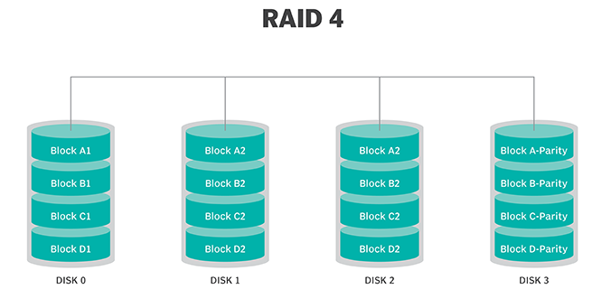

# RAID BASIC INFORMATION

 Basic RAID  

## What is RAID?

RAID (redundant array of independent disks) is a way of storing the same data in different places on multiple hard disks or solid-state drives (SSDs) to protect data in the case of a drive failure. There are different RAID levels, however, and not all have the goal of providing redundancy.

## How RAID works
RAID works by placing data on multiple disks and allowing input/output (I/O) operations to overlap in a balanced way, improving performance. Because using multiple disks increases the mean time between failures, storing data redundantly also increases fault tolerance.
RAID arrays appear to the operating system (OS) as a single logical drive.

RAID employs the techniques of disk mirroring or disk striping. Mirroring will copy identical data onto more than one drive. Striping partitions help spread data over multiple disk drives. Each drive's storage space is divided into units ranging from a sector of 512 bytes up to several megabytes. The stripes of all the disks are interleaved and addressed in order. Disk mirroring and disk striping can also be combined in a RAID array.
In a single-user system where large records are stored, the stripes are typically set up to be small (512 bytes, for example) so that a single record spans all the disks and can be accessed quickly by reading all the disks at the same time.
In a multiuser system, better performance requires a stripe wide enough to hold the typical or maximum size record, enabling overlapped disk I/O across drives.

 RAID controller  

## What is RAID controller
A RAID controller is a device used to manage hard disk drives in a storage array. It can be used as a level of abstraction between the OS and the physical disks, presenting groups of disks as logical units. Using a RAID controller can improve performance and help protect data in case of a crash.

A RAID controller may be hardware- or software-based. In a hardware-based RAID product, a physical controller manages the entire array. The controller can also be designed to support drive formats such as Serial Advanced Technology Attachment and Small Computer System Interface. A physical RAID controller can also be built into a server's motherboard.

With software-based RAID, the controller uses the resources of the hardware system, such as the central processor and memory. While it performs the same functions as a hardware-based RAID controller, software-based RAID controllers may not enable as much of a performance boost and can affect the performance of other applications on the server.

If a software-based RAID implementation is not compatible with a system's boot-up process and hardware-based RAID controllers are too costly, firmware, or driver-based RAID, is a potential option.

Firmware-based RAID controller chips are located on the motherboard, and all operations are performed by the central processing unit (CPU), similar to software-based RAID. However, with firmware, the RAID system is only implemented at the beginning of the boot process. Once the OS has loaded, the controller driver takes over RAID functionality. A firmware RAID controller is not as pricey as a hardware option, but it puts more strain on the computer's CPU. Firmware-based RAID is also called hardware-assisted software RAID, hybrid model RAID and fake RAID.

RAID levels

RAID devices use different versions, called levels. The original paper that coined the term and developed the RAID setup concept defined six levels of RAID -- 0 through 5. This numbered system enabled those in IT to differentiate RAID versions. The number of levels has since expanded and has been broken into three categories: standard, nested and nonstandard RAID levels.
## Standard RAID levels
## RAID 0

   This configuration has striping but no redundancy of data. It offers the best performance, but it does not provide fault tolerance.     

## RAID 1

Also known as disk mirroring, this configuration consists of at least two drives that duplicate the storage of data. There is no striping. Read performance is improved, since either disk can be read at the same time. Write performance is the same as for single disk storage.

 

## RAID 2

This configuration uses striping across disks, with some disks storing error checking and correcting (ECC) information. RAID 2 also uses a dedicated Hamming code parity, a linear form of ECC. RAID 2 has no advantage over RAID 3 and is no longer used.

## RAID 3

This technique uses striping and dedicates one drive to storing parity information. The embedded ECC information is used to detect errors. Data recovery is accomplished by calculating the exclusive information recorded on the other drives. Because an I/O operation addresses all the drives at the same time, RAID 3 cannot overlap I/O. For this reason, RAID 3 is best for single-user systems with long record applications.

## RAID 4

This level uses large stripes, which means a user can read records from any single drive. Overlapped I/O can then be used for read operations. Because all write operations are required to update the parity drive, no I/O overlapping is possible.

## RAID 5

This level is based on parity block-level striping. The parity information is striped across each drive, enabling the array to function, even if one drive were to fail. The array's architecture enables read and write operations to span multiple drives. This results in performance better than that of a single drive, but not as high as a RAID 0 array. RAID 5 requires at least three disks, but it is often recommended to use at least five disks for performance reasons.

RAID 5 arrays are generally considered to be a poor choice for use on write-intensive systems because of the performance impact associated with writing parity data. When a disk fails, it can take a long time to rebuild a RAID 5 array.

## RAID 6

This technique is similar to RAID 5, but it includes a second parity scheme distributed across the drives in the array. The use of additional parity enables the array to continue functioning, even if two disks fail simultaneously. However, this extra protection comes at a cost. RAID 6 arrays often have slower write performance than RAID 5 arrays.

## RAID 10

(RAID 1+0). Combining RAID 1 and RAID 0, this level is often referred to as RAID 10, which offers higher performance than RAID 1, but at a much higher cost. In RAID 1+0, the data is mirrored and the mirrors are striped.

RAID 01 (RAID 0+1). RAID 0+1 is similar to RAID 1+0, except the data organization method is slightly different. Rather than creating a mirror and then striping it, RAID 0+1 creates a stripe set and then mirrors the stripe set.

RAID 03 (RAID 0+3, also known as RAID 53 or RAID 5+3). This level uses striping in RAID 0 style for RAID 3's virtual disk blocks. This offers higher performance than RAID 3, but at a higher cost.

RAID 50 (RAID 5+0). This configuration combines RAID 5 distributed parity with RAID 0 striping to improve RAID 5 performance without reducing data protection.

 Hardware RAID vs. software RAID 

As with RAID controllers, RAID is implemented through either hardware or software. Hardware-based RAID supports different RAID configurations and is especially well suited for RAID 5 and 6. Configuration for hardware RAID 1 is good for supporting the boot and application drive process, while hardware RAID 5 is appropriate for large storage arrays. Both hardware RAID 5 and 6 are well suited for performance.

Hardware-based RAID requires a dedicated controller be installed in the server. RAID controllers in hardware are configured through card basic I/O system or Option ROM (read-only memory) either before or after the OS is booted. RAID controller manufacturers also typically provide proprietary software tooling for their supported OSes.

Software-based RAID is provided by several modern OSes. It is implemented in a number of ways, including:

as a component of the file system;
as a layer that abstracts devices as a single virtual device; and
as a layer that sits above any file system.
This method of RAID uses some of the system's computing power to manage a software-based RAID configuration. As an example, Windows supports software RAID 0, 1 and 5, while Apple's macOS supports RAID 0, 1 and 1+0.

 Benefits of RAID 

* Improved cost-effectiveness because lower-priced disks are used in large numbers.
* Using multiple hard drives enables RAID to improve the performance of a single hard drive.
* Increased computer speed and reliability after a crash, depending on the configuration.
* Reads and writes can be performed faster than with a single drive with RAID 0. This is because a file system is split up and distributed across drives that work together on the same file.
* There is increased availability and resiliency with RAID 5. With mirroring, two drives can contain the same data, ensuring one will continue to work if the other fails.

 Downsides of using RAID 

* Nested RAID levels are more expensive to implement than traditional RAID levels, because they require more disks.
* The cost per gigabyte for storage devices is higher for nested RAID because many of the drives are used for redundancy.
* When a drive fails, the probability that another drive in the array will also soon fail rises, which would likely result in data loss. This is because all the drives in a RAID array are installed at the same time, so all the drives are subject to the same amount of wear.
* Some RAID levels -- such as RAID 1 and 5 -- can only sustain a single drive failure.
* RAID arrays, and the data in them, are vulnerable until a failed drive is replaced and the new disk is populated with data.
* Because drives have much greater capacity now than when RAID was first implemented, it takes a lot longer to rebuild failed drives.
* If a disk failure occurs, there is a chance the remaining disks may contain bad sectors or unreadable data, which may make it impossible to fully rebuild the array.
However, nested RAID levels address these problems by providing a greater degree of redundancy, significantly decreasing the chances of an array-level failure due to simultaneous disk failures.

 When should you use RAID? 

* When a large amount of data needs to be restored. If a drive fails and data is lost, that data can be restored quickly, because this data is also stored in other drives.
* When uptime and availability are important business factors. If data needs to be restored, it can be done quickly without downtime.
* When working with large files. RAID provides speed and reliability when working with large files.
* When an organization needs to reduce strain on physical hardware and increase overall performance. As an example, a hardware RAID card can include additional memory to be used as a cache.
* When having I/O disk issues. RAID will provide additional throughput by reading and writing data from multiple drives, instead of needing to wait for one drive to perform tasks.
* When cost is a factor. The cost of a RAID array is lower than it was in the past, and lower-priced disks are used in large numbers, making it cheaper.

