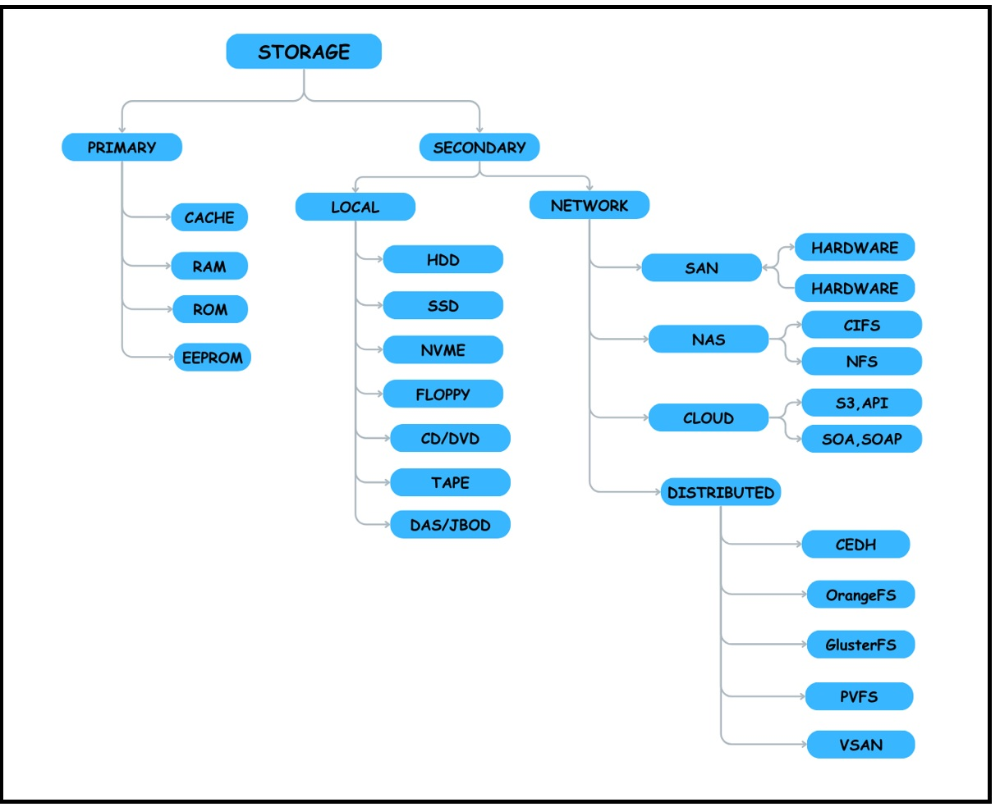

# STORAGE INFORMATION

 What is Storage

Storage is a process through which digital data is saved within a data storage device by means of computing technology. Storage is a mechanism that enables a computer to retain data, either temporarily or permanently.
Storage devices such as flash drives and hard disks are a fundamental component of most digital devices since they allow users to preserve all kinds of information such as videos, documents, pictures and raw data.

Storage may also be referred to as computer data storage or electronic data storage.

## Common storage devices

